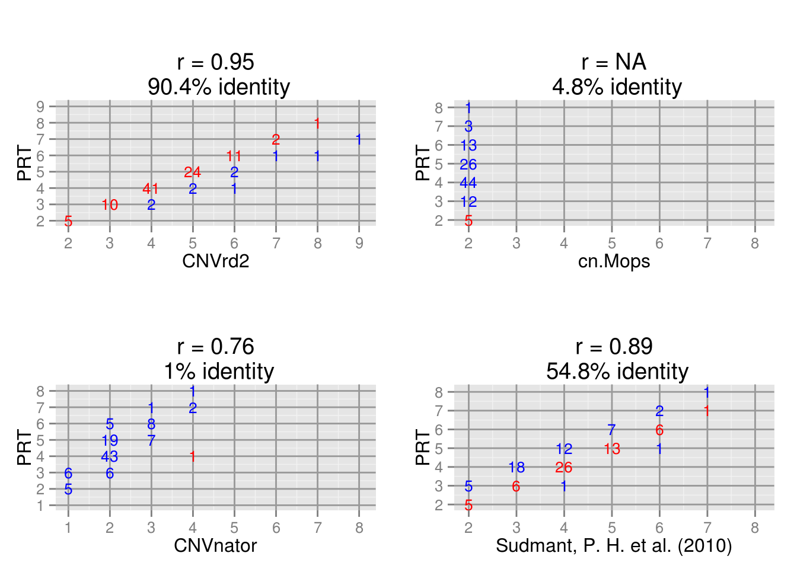

### Below describes an example to make plots for comparing between copy-number callls of different methods

### Make a function

```r
library('ggplot2')

library("gridExtra")

plot.inter <- function(x, y, xlab = NULL, ylab = NULL, main = NULL, xlim = NULL, ylim = NULL){
  x <- x
  y <- y
  zz1 <- data.frame()
  z <- data.frame(x, y)

  for (ii in min(x):max(x)){
    for (jj in min(y):max(y)){
              ltemp <- length(z[z[, 1] == ii &
                           z[, 2] == jj,1])
    if (ltemp > 0){
      z4 <- 5
                             
      zz1 <- rbind(zz1, c(ii, jj, ltemp, z4))
    }
            }
  }
  colnames(zz1) <- c("z1", "z2", "z3", "z4")
  zlength1 <- length(z[z[, 1] == z[, 2], 1])
  ztext1 <- paste(round(100*zlength1/length(x), 1), "% identity", sep ="")
  #theme_set(theme_grey(16))

    colZZ <- ifelse(zz1$z1 == zz1$z2, "red", "blue")

  
  p1 <- ggplot(data = zz1, aes(z1, z2), show_guide = TRUE) +
#      geom_point(aes(size = 1, alpha = 0.9), show_guide = FALSE)  +
          geom_text(data = zz1, aes(z1, z2, label = z3
                        #,                        colour = 'blue'
                        #, vjust = 0.1, hjust = 0.1
#                        , face = "bold"
                        ,size = 0.1), colour = as.factor(colZZ), show_guide = FALSE )  +
                            coord_cartesian(xlim = xlim, ylim = ylim) + xlab(xlab) + ylab(ylab) + ggtitle(paste(main, "\n",ztext1)) + theme(panel.grid.major = element_line(colour = "#999999")) +
                                scale_y_continuous(breaks=c(0, 1,2, 3,4, 5, 6, 7,8, 9, 10, 11)) +
                                    scale_x_continuous(breaks=c(0, 1,2, 3, 4, 5, 6, 7, 8, 9, 10, 11))
#size = factor(z3)
  return(p1)
}
```

### Read DEFB103 CN results


```r
bb <- read.table("Join.DEFB103.CNVrd2.PRT.cnmops.CNVnator.Peter.txt", row.names=1)

### Name columns
nameAll <- c("CNVrd2", "PRT",  "cn.Mops", "CNVnator", "Sudmant, P. H. et al. (2010)")
```
### Draw each comparison and then combine all into one figure (The same as Figure 3 in the main paper CNVrd2 on: http://journal.frontiersin.org/article/10.3389/fgene.2014.00248/full)


```r
### Choose columns 1 and 2
ii = 1; jj = 2

### Make a temporary data.frame
bbTemp <- bb

bbTemp <- bbTemp[!is.na(bbTemp[, ii]) & !is.na(bbTemp[, jj]),]

### Choose max, min of all CN classes to set xlim and ylim
xy <- range(c(bbTemp[, ii], bbTemp[, jj]))

### Plot
p1 <- plot.inter(x = bbTemp[, ii], y = bbTemp[, jj], xlab = nameAll[ii],
                 ylab = nameAll[jj ],
                 xlim = c(xy[1] - 0.3, xy[2] + 0.4),
                 ylim = c(xy[1] - 0.3, xy[2] + 0.4),
                 main = paste("\n r = ", round(cor(bbTemp[, ii], bbTemp[, jj]), 2), sep = ""))

ii = 3

bbTemp <- bb

bbTemp <- bbTemp[!is.na(bbTemp[, ii]) & !is.na(bbTemp[, jj]),]

xy <- range(c(bbTemp[, ii], bbTemp[, jj]))

p2 <- plot.inter(x = bbTemp[, ii], y = bbTemp[, jj], xlab = nameAll[ii],
                 ylab = nameAll[jj ],
                 xlim = c(xy[1] - 0.3, xy[2] + 0.4),
                 ylim = c(xy[1] - 0.3, xy[2] + 0.4),
                 main = paste("\n r = ", round(cor(bbTemp[, ii], bbTemp[, jj]), 2), sep = ""))
```

```
## Warning in cor(bbTemp[, ii], bbTemp[, jj]): the standard deviation is zero
```

```r
ii = 4
bbTemp <- bb
bbTemp <- bbTemp[!is.na(bbTemp[, ii]) & !is.na(bbTemp[, jj]),]

xy <- range(c(bbTemp[, ii], bbTemp[, jj]))


p3 <- plot.inter(x = bbTemp[, ii], y = bbTemp[, jj], xlab = nameAll[ii],
                 ylab = nameAll[jj ],
                 xlim = c(xy[1] - 0.3, xy[2] + 0.4),
                 ylim = c(xy[1] - 0.3, xy[2] + 0.4),
                 main = paste("\n r = ", round(cor(bbTemp[, ii], bbTemp[, jj]), 2), sep = ""))


ii = 5

bbPTemp <- bb

bbPTemp <- bbPTemp[!is.na(bbPTemp[, ii]) & !is.na(bbPTemp[, jj]),]

xy <- range(c(bbPTemp[, ii], bbPTemp[, jj]))


p4 <- plot.inter(x = bbPTemp[, ii], y = bbPTemp[, jj], xlab = nameAll[ii],
                 ylab = nameAll[jj ],
                 xlim = c(xy[1] - 0.3, xy[2] + 0.4),
                 ylim = c(xy[1] - 0.3, xy[2] + 0.4),
                 main = paste("\n r = ", round(cor(bbPTemp[, ii], bbPTemp[, jj]), 2), sep = ""))


########Plot all results
grid.arrange(p1, p2, p3, p4,   nrow = 2)
```


